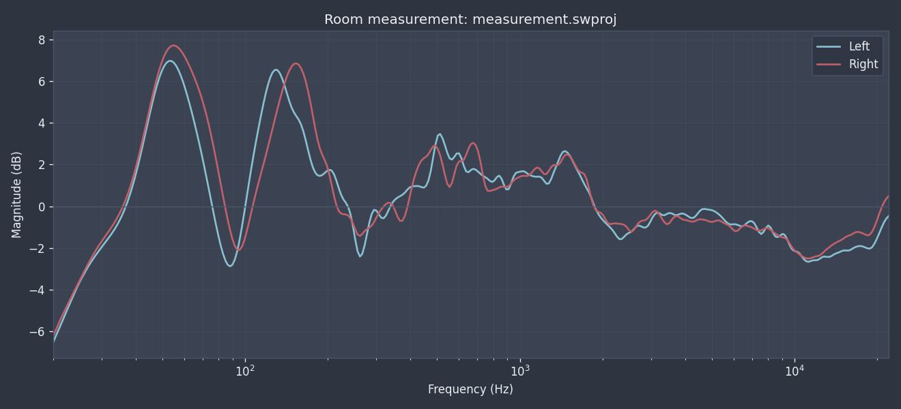
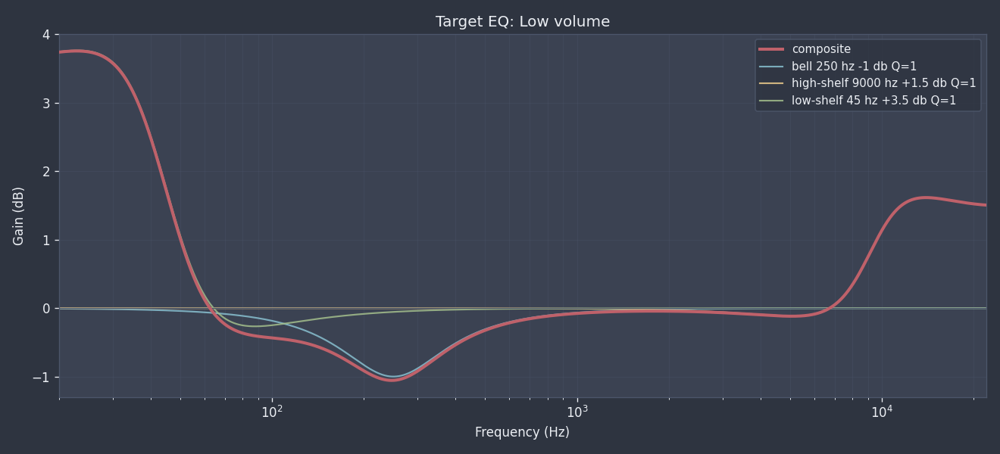

# SWProj

<!-- deno-fmt-ignore -->
> [!Caution]
> Status: pre pre pre alpha DO NOT USE...

Taken from SoundID Reference Measure output file format name, `swproj` is a CLI
tool to parse, visualize, and "transpile" the SoundID measurement files to work
on Linux machines (e.g. export to
[PipeWire Filter-Chain](https://docs.pipewire.org/page_module_filter_chain.html)
configuration, or [CamillaDSP](https://github.com/HEnquist/camilladsp), or other
open source DSP/RC software).

Room measurement:

```console
$ swproj measure examples/measurement.swproj -o examples/measurement.png
measurement: measurement.swproj
  points:                355
  span:                  20.0 hz .. 22000.0 hz (log-spaced)
  left:
    dynamic range:        13.51 db
    min / max:           -6.54 / +6.97 db
    mean (>= 200 hz):    -0.11 db
    top peaks:             53.8 hz +6.97 db,  128.4 hz +6.54 db,  512.9 hz +3.47 db
    top dips:              88.2 hz -2.88 db, 11228.2 hz -2.66 db, 13153.6 hz -2.43 db
  right:
    dynamic range:        13.95 db
    min / max:           -6.24 / +7.71 db
    mean (>= 200 hz):    -0.06 db
    top peaks:             54.9 hz +7.71 db,  153.4 hz +6.85 db,  676.6 hz +3.04 db
    top dips:            11228.2 hz -2.50 db,   95.4 hz -2.09 db,  261.8 hz -1.42 db
  L-R asymmetry (30-300 hz):  max 3.17 db, rms 1.68 db
wrote examples/measurement.png
```



Target EQ:

```
$ swproj target examples/target.json -o examples/target.png
target eq: target.json  (name: 'Low volume')
  [0]       bell  f=  250.0 hz  gain=-1.00 db  Q=1.00
  [1] high-shelf  f= 9000.0 hz  gain=+1.50 db  Q=1.00
  [2]  low-shelf  f=   45.0 hz  gain=+3.50 db  Q=1.00
  realised over 20-22k hz:  max +3.76 db at 22.9 hz, min -1.06 db at 246.6 hz
wrote examples/target.png
```


